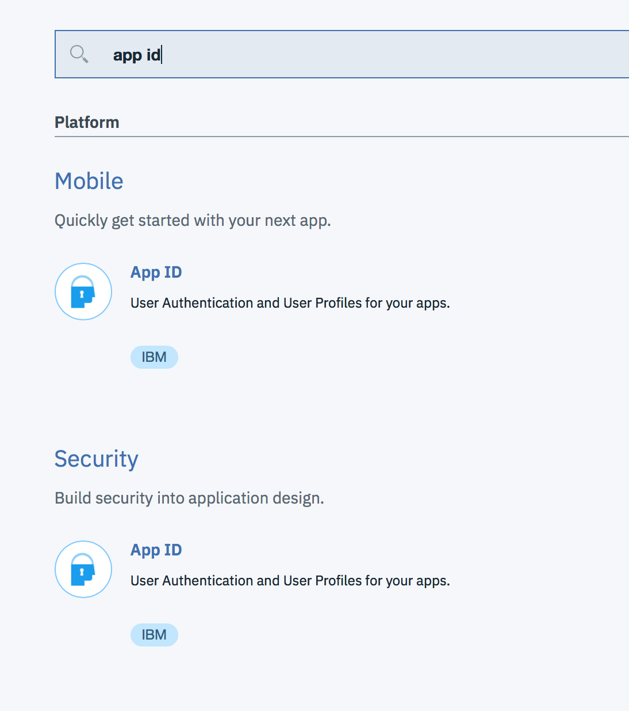
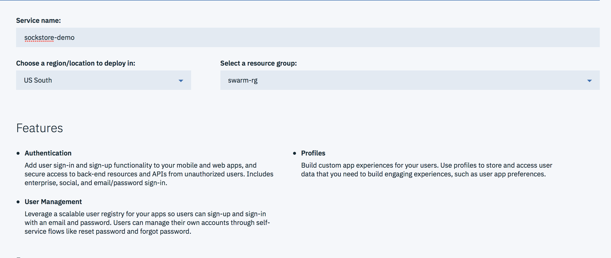
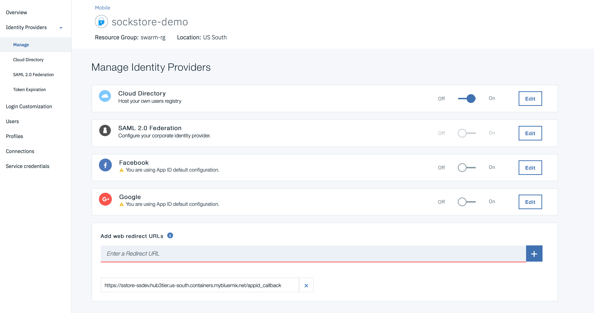
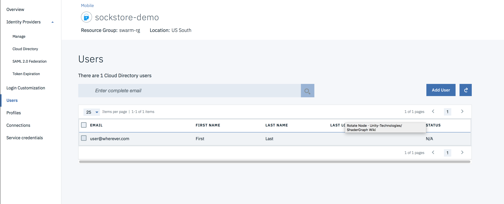

## App ID Setup

### Pre-requisites

1. An ibm container services cluster (lite/free cluster not supported)
2. Cert-manager installed and configured on cluster [see here](../cert-manager/README.md)
3. Access to a bluemix org, space and resource group

### Setup App ID

1. Go to bluemix catalog and select App Id

 

2. Name your appid instance (referred to as appid name from now on)



3. In the manage tab, configure appid by adding the callback url to your cluster (it is the selected subdomain with /appid_callback appended to the path)



4. Disable google and facebook as they do not function with ingress at time of writing.

5. Create a user to test on the users tab with the add user button



6. Login to bluemix and issue the following commands replacing bracket variables with your real ones.

"appid alias" is a name you will pass into helm later to link to the ingress. You can use anything you want that doesn't already exist

"appid name" is the name of your appid instance you created earlier.

"chart name" - this is the name you want to use for the helm install

"namespace" - whichever kube namespace you want to use

"host" - the final host

"cluster domain" - this is the ingress url provided by bx cs cluster-get [cluster name]

**NOTE:** Some of these commands require specific privileges that your admin may need to grant. In addition occasionally they need to be run a few minutes apart.

```
bx login
bx target -g "[resource group]" -o "[bluemix organization]" -s "[bluemix space]"
bx resource service-alias-create "[appid alias]" --instance-name "[appid name]" -s "[bluemix space]"
bx cs cluster-service-bind [cluster name] [namespace] [appid alias]
```

7. Install/Re-install with the following helm command

```
cd sockstore/deploy/kubernetes
helm upgrade --install [chart name] --namespace [namespace] --set ingress.host='[host]',ingress.subdomain='[cluster domain]',appid.alias='[appid alias]' helm-chart
```

Give it a minute to finish loading and go to the domain [host].[cluster domain]

You should be immediately redirected to a login page for appid. Login with the user email and password you created earlier. 

#### Notes

* When binding the appid alias I chose to use the default secret name and build it directly into the ingress yaml.
* Certificate for cert-manager expects the cluster issuer to be called `letsencrypt-staging-cluster-issuer`. This could be made a variable.
* Cluster issuer is currently a staging issuer. Can be changed manually.