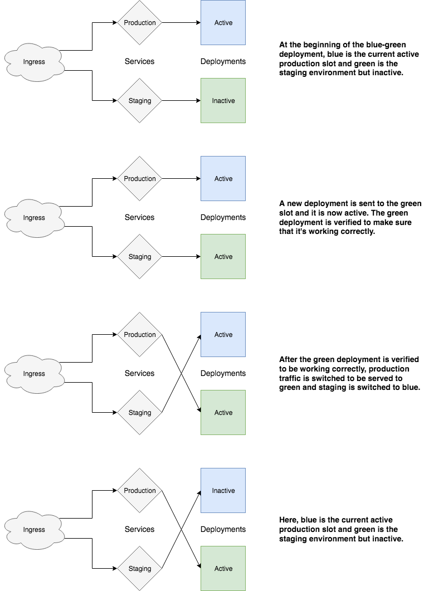

# Blue-Green Deployment

Blue-green deployment is a deployment strategy designed to reduce downtime and risk. Say you have a production environment running that needs to be updated. You don't want to bring down the production environment in order to update it. That's where blue-green deployment comes in.

The basics behind blue-green is that you have a production environment running, let's label it BLUE. You now want to update your deployment. Instead of modifying your production environment, you have another environment that you update to ensure that the BLUE deployment is still up. This second environment is the GREEN deployment. Once the GREEN deployment is running successfully without any problems, you then switch all production traffic over to GREEN and (optionally) spin down the BLUE deployment.

This ensures that there's always one environment up and ready to serve production traffic. Having two environments also ensures that you can rollback and switch to the other environment in case a problem arises with the new deployment.



### Objective: Set up blue-green using Helm

### Prerequisites
- IBM Cloud cluster
- Helm charts for deploying an application

## Instructions for adding blue-green functionality to your Helm release

Blue-green is made much simpler using Helm due to the ability to quickly spin up a new release and terminate another one.

You will need to:
  - Add values to your Helm values.yaml
  - Have two separate YAML files for each deployment (one blue, one green)
  - Have both a production and staging YAML for each service
  - Modify your ingress YAML to point to both production and staging

1. First, you need to add additional values to your values.yaml file.
  ```
  green:
    enabled: false
  blue:
    enabled: false
  productionSlot: blue
  ingress:
    hostname: domain.com
    stagehostname: stage.domain.com
  ```
  Notice how both blue and green are disabled. These will be enabled/disabled during the deployment process depending on which slot will be the new productionSlot.

2. For each deployment, you will need a separate YAML file for blue and green. Within each, you will need to specify a few things. A trimmed down version of the YAML file for each is below, showing the relevant values.
  ```
  {{ if .Values.blue.enabled }}
  kind: Deployment
  metadata:
    name: {{ .Values.svc.name }}-blue
  spec:
    template:
      metadata:
          slot: blue
      spec:
        containers:
        - name: {{ .Values.svc.name }}-blue
  {{ end }}
  ```
  ```
  {{ if .Values.green.enabled }}
  kind: Deployment
  metadata:
    name: {{ .Values.svc.name }}-green
  spec:
    template:
      metadata:
        labels:
          slot: green
      spec:
        containers:
        - name: {{ .Values.svc.name }}-green
  {{ end }}
  ```
  You'll need to add an if statement to each, checking to see if its respective slot is enabled. In addition, modify the metadata to append the color to the deployment name and add a slot label in order to differentiate the two deployments.

3. You will also need to modify the service YAML that is attached to the deployment slightly, as well as create another service YAML specifically for a staging environment.

  For the service YAML that will be used for production, you only need to add one value to it:
  ```
  spec.selector.slot: {{ .Values.productionSlot }}
  ```

  For the service YAML that will be used for staging, it will be mostly identical to the production one except it needs to be labelled specifically as staging along with some logic to determine which slot it should be pointing to.
  ```
  kind: Service
  metadata:
    name: {{ .Values.svc.name }}-stage
  spec:
    selector:
      {{- if eq .Values.productionSlot "blue" }}
      slot: green
      {{- else }}
      slot: blue
      {{- end }}
  ```

4. The final step is to modify your ingress.yaml to handle both production and staging environments. A portion of an example Ingress YAML if below. Notice how you now have multiple hosts. Each host points to its respective backend service, but they both share the same service port.
  ```
  kind: Ingress
  spec:
    tls:
    - hosts:
      - {{ .Values.ingress.hostname }}
      - {{ .Values.ingress.stagehostname }}
    rules:
    - host: {{ .Values.ingress.hostname }}
      http:
        paths:
        - path: {{ .Values.ingress.path }}
          backend:
            serviceName: {{ .Values.svc.name }}
            servicePort: {{ .Values.svc.port }}
    - host: {{ .Values.ingress.stagehostname }}
      http:
        paths:
        - path: {{ .Values.ingress.path }}
          backend:
            serviceName: {{ .Values.svc.name }}-stage
            servicePort: {{ .Values.svc.port }}
  ```

5. Now that the Helm charts are done, you're ready to actually deploy them! The easiest way to do this is to use a shell script that will check to see which slot is currently the productionSlot, deploy to the other slot, verify that the new deployment is working, switch to the new deployment, and then spin down the old deployment. Sounds like a doozy, but the script itself it very straightforward.
  ```
  #!/bin/bash

  # Read current value of productionSlot to deploy release in other slot
  currentSlot=`(helm get values --all <NAME-OF-YOUR-HELM-CHART> | ggrep -Po 'productionSlot: \K.*')`
  if [ "$currentSlot" == "blue" ]; then
      newSlot="green"
      oldSlot="blue"
  else
      newSlot="blue"
      oldSlot="green"
  fi

  echo "currentSlot: $currentSlot"
  echo "newSlot: $newSlot"

  # Deploying to new slot
  deploymentOption=$newSlot.enabled=true
  helm upgrade --install <NAME-OF-YOUR-HELM-CHART> ./broker --set $deploymentOption --reuse-values

  # Checking that the deployment is healthy and ready to be switched
  READY=$(kubectl get deploy <NAME-OF-YOUR-DEPLOYMENT>-$newSlot -o json | jq '.status.conditions[] | select(.reason == "MinimumReplicasAvailable") | .status' | tr -d '"')
  while [[ "$READY" != "True" ]]; do
      READY=$(kubectl get deploy <NAME-OF-YOUR-DEPLOYMENT>-$newSlot -o json | jq '.status.conditions[] | select(.reason == "MinimumReplicasAvailable") | .status' | tr -d '"')
      sleep 5
  done
  echo "Deployment Ready: $READY"

  # Promoting deployment to serve production traffic
  deploymentOption=productionSlot=$newSlot
  helm upgrade --install <NAME-OF-YOUR-HELM-CHART> ./broker --set $deploymentOption --reuse-values

  # Deleting deployment in old slot
  deploymentOption=$oldSlot.enabled=false
  helm upgrade --install <NAME-OF-YOUR-HELM-CHART> ./broker --set $deploymentOption --reuse-values
  ```

  The final command to delete the deployment in the old slot is optional. You can remove that if you want to have your production and staging environments up at all times. You can add a delay before promoting the new deployment to serve production traffic if you want time to go to navigate to the domain of the staging environment and verify that everything is in order.

  If you want to check and see which color is currently productionSlot, then you can do so with Helm.
  ```
  helm get values <NAME-OF-YOUR-HELM-CHART>
  ```

### Helpful Links
- https://docs.helm.sh/chart_best_practices/#labels
- https://www.ianlewis.org/en/bluegreen-deployments-kubernetes
- https://medium.com/@saraswatpuneet/blue-green-deployments-using-helm-charts-93ec479c0282
