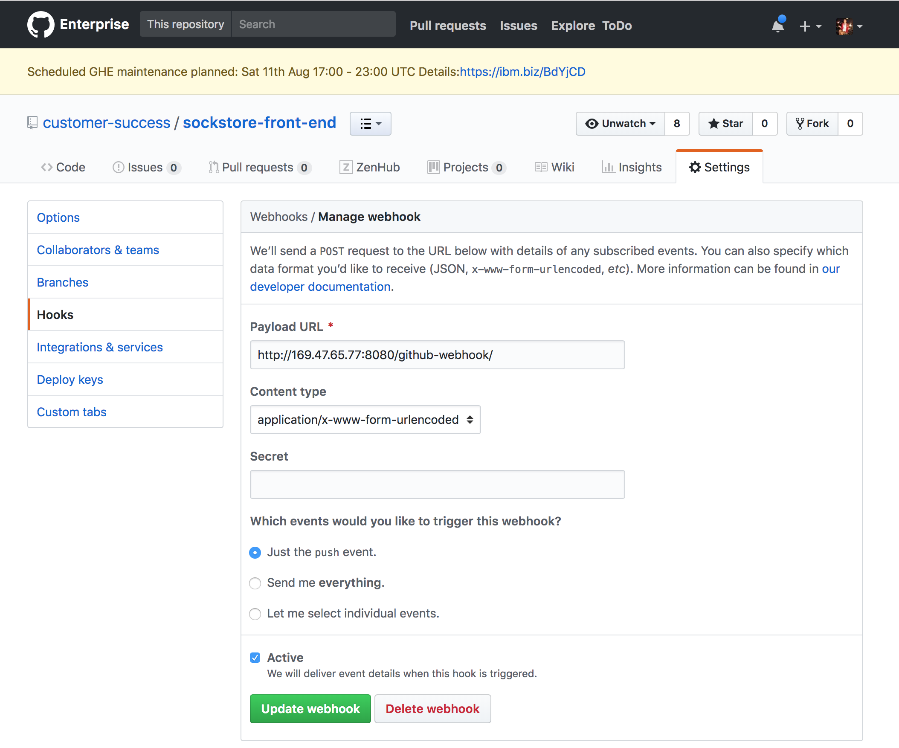

# Sockstore Jenkins Pipeline Documentation
This documentation walks you through how to build a continuous delivery pipeline for the Sockstore Application using Jenkins on IBM Cloud.  **This documentation is NOT a best practice document**, it is simply my experience with Jenkins and creating a Deployment pipeline for a multi-micro-service application.  

## Getting Started
The Sockstore application has 8 microservices and this documentation walks through how I created Jenkins jobs for deploying the app into multiple regions (one at a time).


Make sure that you have a Kubernetes cluster in each region that you'd like to deploy the Sockstore application.  The correct secrets need to be moved from the default namespace to whichever Kubernetes cluster namespace(s) that you plan to use.  For example, when I launched the Sockstore application I utilized the namespace dev-ci-cd.

Sockstore is integrated with using IBM's AppID so another step to setting up the cluster for application is to bind the cluster namespace to an AppID instance. This [link](https://github.ibm.com/customer-success/swarm/tree/master/sockstore/docs/appid) explains how to create an AppID and bind it to a cluster.  **Be sure to double check that you have the correct access permissions on the cluster to perform this step.**

Once you have a Kubernetes Cluster and a namespace set up, you're ready to get started!

## Install Jenkins using Helm
Use the documentation [here](https://github.com/helm/charts/blob/master/stable/jenkins/README.md) as a resource to install Jenkins onto your Kubernetes cluster.  

Below is the helm command I used to start up Jenkins on my cluster.  As shown below, I named my Jenkins instance, jenkins, and deployed it into a namespace also called jenkins.  
`helm install --name jenkins stable/jenkins --namespace jenkins`

Upon executing this command, I was prompted with instructions in order to set up access to the Jenkins instance.  

  1. Get your 'admin' user password by running:

  `printf $(kubectl get secret --namespace jenkins jenkins-jenkins -o jsonpath="{.data.jenkins-admin-password}" | base64 --decode);echo`

  2. Get the Jenkins URL to visit by running these commands in the same shell:
  NOTE: It may take a few minutes for the LoadBalancer IP to be available.
        You can watch the status of by running 'kubectl get svc --namespace jenkins -w jenkins-jenkins'

  `export SERVICE_IP=$(kubectl get svc --namespace jenkins jenkins-jenkins --template "{{ range (index .status.loadBalancer.ingress 0) }}{{ . }}{{ end }}")`

  `echo http://$SERVICE_IP:8080/login`

  3. Login with the password from step 1 and the username: admin

Once you acquire the Jenkins URL and the password, I realized that my Jenkins instance was not functioning properly.  After some debugging I determined that in order for Jenkins to run successfully on my IBM kubernetes cluster I needed to override a couple of default values in the Jenkins Helm Chart.  

`helm upgrade --install jenkins stable/jenkins --namespace jenkins --set Persistence.Annotations."volume\.beta\.kubernetes\.io/storage-class"=ibmc-file-retain-gold,Persistence.Size=20Gi `

Resetting the `Persistence Annotation` and the `Persistence Volume Size` fixed the issue and I could access the UI of my Jenkins instance after re-running the commands above to identify the Jenkins URL and password.

## Install Packages & Tools
Now that Jenkins is running and you can access the UI, it's now time to install any packages that your scripts will need to run successfully.  For example, I needed to do things like:
1. Install IBM Cloud CLI

To do this I used `kubectl exec -it <insert Jenkins pod> -- /bin/bash` then ran `curl -fsSL https://clis.ng.bluemix.net/install/linux | sh` to install IBM Cloud CLI

2. Install IBM Cloud Container Registry CLI plugin

Next, I installed the container-registry plugin: `ibmcloud plugin install container-registry`

3. Login to IBM Cloud with apikey

I login using an apikey I previously created in my IBM Cloud account, documentation to do this is [here](https://console.bluemix.net/docs/iam/userid_keys.html#creating-an-api-key). The command I used was: `ibmcloud login --apikey <insert apikey>`

4. Install kubectl

```
apt-get install -y apt-transport-https
curl -s https://packages.cloud.google.com/apt/doc/apt-key.gpg | apt-key add -
touch /etc/apt/sources.list.d/kubernetes.list
echo "deb http://apt.kubernetes.io/ kubernetes-xenial main" | tee -a /etc/apt/sources.list.d/kubernetes.list
apt-get update
apt-get install -y kubectl
```

5. Install Helm

```
curl https://raw.githubusercontent.com/kubernetes/helm/master/scripts/get > get_helm.sh
chmod 700 get_helm.sh
./get_helm.sh
```

**The problem with installing these packages and logging in this way (above) is that if and when the stateless pod fails and a new one gets brought up, then the tools / authentication will all be lost.**

Instead of manually doing all of the installs above I decided to execute the setup inside my jenkins scripts.  That way the scripts execute the following code block in order to ensure the set up of the cluster config, kubectl and Helm each time.
```bash
apt-get update -y
apt-get upgrade -y

apt-get install -y jq
apt-get install -y curl

# Install IBM Cloud CLI
curl -fsSL https://clis.ng.bluemix.net/install/linux | sh

# Install Kubernetes CLI
curl -LO https://storage.googleapis.com/kubernetes-release/release/$(curl -s https://storage.googleapis.com/kubernetes-release/release/stable.txt)/bin/linux/amd64/kubectl
chmod +x ./kubectl
mv ./kubectl /usr/local/bin/kubectl

# Install Helm CLI
curl https://raw.githubusercontent.com/kubernetes/helm/master/scripts/get > get_helm.sh
chmod 700 get_helm.sh
./get_helm.sh

# IBM Cloud and Cluster setup
ibmcloud login --apikey ${API_KEY} -a ${API_URL}
ibmcloud plugin install container-service -r Bluemix
ibmcloud cs init
CLUSTER_CONFIG="$(ibmcloud cs cluster-config ${CLUSTER_NAME})"
KUBE_CONFIG=`echo "${CLUSTER_CONFIG}" | grep -Po 'KUBECONFIG=\K.*'`
export KUBECONFIG=${KUBE_CONFIG}

# Extra Setup for a Build Job script. Necessary in order to push images to container-Registry.
ibmcloud plugin install container-registry
```

## Connect Jenkins & IBM Github Enterprise
Inside Jenkins I created a Credential for accessing the necessary Github Enterprise repositories.  In order to set this up I followed this [document](https://stackoverflow.com/questions/48330402/secret-text-git-credentials-not-showing-up-in-jenkins-project-source-code-mana?answertab=active#tab-top).

Now that Jenkins is able to access Github Enterprise, you'll need to set up a webhook in each Github repository that you'd like to use a push commit to trigger a Jenkins Job.  

To do this, navigate to your desired github repository page, go to the Settings tab and click the Hooks link in the left side list.  Click Add webhook and the Payload URL should be: `Jenkins URL/github-webhook/`

*The image below shows an example of creating a webhook for a Jenkins instance running at http://169.47.65.77:8080*



## Create Build Jobs
In order to run Sockstore you'll need to create a Build job for each of the eight micro-services.  This section will walk you through how to set up a Build job for one micro-service that can be replicated for each micro-service.  

Start by creating a Jenkins freestyle project, name it, fill out the description of this micro-service build job, and click the **This project is parameterized**.  The sockstore-front-end micro-service has two parameters: IMAGE_NAME (string parameter) and API_KEY (password parameter).  

*The image below shows an example of creating a build job for sockstore-front-end microservice*


Next, add the sockstore-front-end github repository in the Source Code Management section.  Since my github repo is in Github Enterprise I had to use the Github Credential I created earlier to give Jenkins access to Github Enterprise.  

Also, make sure to click on the 'GitHub hook trigger for GITScm polling' under the Build Trigger section so that this Build job will be triggered by a push to the github repo/branch that we connected.

*The image below shows an example of connecting a build job for sockstore-front-end microservice to its github repository*


The next section to fill out is the Build Step.  I utilized the 'Execute Shell' type and start by making sure that the Jenkins is logged into ibmcloud using the API_KEY so that our script will be able to run successfully.  

*The image below shows the Execute Shell and the script I used for creating the micro-service's image*


The final step for setting up a Build Job is the 'Post-build Action'.  The type of Post-build action is a Build Trigger, and we want to trigger the deploy job by it's name/future name.  We want to pass the new image tag as a parameter to the Deploy job so you'll need to add a parameter as shown in the photo below.

*The image below shows the final Build job step of setting up the Post-Build Action to trigger a Deploy with the new image tag*


## Create Deploy Job
The way I designed this Jenkins deploy pipeline was using one Deploy Job.  This section will walk you through how to set up a Deploy job which will be the job each micro-service Build Job triggers as a post-build action.  

The first step of creating the Deploy job is setting up the parameters.  Below is the full list of job parameters that I required.  Each microservice image tag has two parameters, one default image that is reliable and one blank image tag that is used when a Build Job triggers this Deploy job while passing a *new* image tag for that micro-service.

*These images below display every parameter necessary for the Sockstore Deploy Job*


Next, add the swarm github repository in the Source Code Management section. Since this github repo is in Github Enterprise I had to use the Github Credential I created earlier to give Jenkins access to Github Enterprise. Also this job should not have any Build Trigger checked because the Build Jobs will trigger the deploy job.

*This image is an example of how to set up the Source Code Management, Build Triggers, and Build Environment sections*


Lastly, complete the Build Step.  As you can see below, inside the build step I have an if conditional for each image tag that checks if the non-default image tag value is blank, and if it is, then set it equal to the default image tag that already exists inside of the Deploy Job.  **Please keep in mind that this is NOT a best practice.**  I found that with my design, managing all of the image tags is a challenge so I'd like to improve this.

*This image displays the Execute shell code that is used in the Build section of the Deploy Job*


## Set Global Variables
In order to build the micro-service images and to deploy the Sockstore application I created a few global variables.  All of the Jenkins jobs (eight build jobs, one deploy job) need to know these variables and turning them into global variables makes it easier to switch them for deploying the app into another region.  

*This image displays the three global variables needed for the Sockstore Application*


For example, when I'd like to build images and deploy the app in the US South region, then I set...

Global variables
- `API_URL=https://api.ng.bluemix.net`
- `REGISTRY_URL=registry.ng.bluemix.net`
- `REGISTRY_NAMESPACE=swarm`

Deploy Job Parameters
- `INGRESS_HOST=dev-ci-cd`
- `INGRESS_SUBDOMAIN=swarm-mzr-ussouth.us-south.containers.appdomain.cloud`
- `APPID_ALIAS=ci-cd`
- `CLUSTER_NAME=swarm-mzr-south`
- `CLUSTER_NAMESPACE=dev-ci-cd`

But if I wanted to deploy to a different cluster in another region, then I'd go into jenkins and change...

Global variables
- `API_URL=https://api.<INSERT region initials>.bluemix.net`
- `REGISTRY_URL=registry.<INSERT region initials>.bluemix.net`
- `REGISTRY_NAMESPACE= <INSERT REGISTRY NAMESPACE>`

Deploy Job Parameters
- `INGRESS_HOST=<INSERT ingress host>`
- `INGRESS_SUBDOMAIN=<INSERT ingress subdomain>`
- `APPID_ALIAS=<INSERT AppID alias name>`
- `CLUSTER_NAME=<INSERT cluster name>`
- `CLUSTER_NAMESPACE=<INSERT cluster namespace>`

## Lesson Learned
I chose this Jenkins design based on familiarity with having one deploy job. If I were to go back and make it better, I would because I've found that, with my design, managing all of the image tags is a challenge.  Having only one deploy job that launches the entire application is not optimal.  Instead I'd have one deploy job for **each** micro-service that is responsible for deploying ONLY that micro-service.  

## Conclusion
Overall, this document walks through the set up of Jenkins on IBM Cloud and also how to create the Build and Deploy jobs for Sockstore.  As I mentioned in the Lesson Learned section, this is just one way to implement Jenkins on IBM Cloud.  My **main** intention is to share with you how I was able to execute my design on an IBM Cloud Cluster.  

## Helpful Links
[AppID Documentation](https://github.ibm.com/customer-success/swarm/tree/master/sockstore/docs/appid)

[stable/jenkins](https://github.com/helm/charts/blob/master/stable/jenkins/README.md)

[Create IBM apikey](https://console.bluemix.net/docs/iam/userid_keys.html#creating-an-api-key)

[Create Jenkins Credential](https://stackoverflow.com/questions/48330402/secret-text-git-credentials-not-showing-up-in-jenkins-project-source-code-mana?answertab=active#tab-top)
