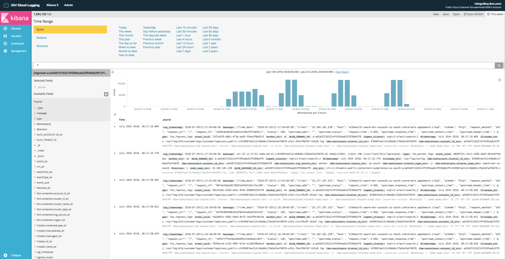

# Log Collection on the IBM Cloud platform

### Objective: To identify how to implement log collection for various runtimes on the IBM Cloud platform and ingest them through the Log Analysis service.

  

## Collecting logs from an application running in IBM Cloud Container services
You can configure log collection for an application using the [IBM Cloud CLI with Container Services plugin](https://console.bluemix.net/docs/containers/cs_cli_install.html#cs_cli_install). In order for logs to be collected, your application must output logs to a `.log` file on your cluster. For a Node application, you can do this using a library such as Winston.

To create a simple logging configuration that points to your `.log` file on your cluster and sends logs to Log Analysis, you would use a command similar to this one:
```
bx cs logging-config-create <cluster> --namespace <namespace> --logsource application --type ibm --app-paths '/var/log/<log file>.log'
```

For logs to be collected and sent to Log Analysis successfully, each individual log event must be in JSON format on it's own line. The log should contain a `message` field as well.

You can specify additional log sources, such as for worker nodes or Kubernetes components in case you want to monitor activity throughout your cluster. See the documentation in the `Helpful Links` section below for more information on how to configure additional log sources.

#### Helpful Links
- https://console.bluemix.net/docs/containers/cs_health.html#health
- https://console.bluemix.net/docs/services/CloudLogAnalysis/containers/containers_kubernetes.html#containers_kubernetes

## Collecting logs from a Cloud Foundry application
Logs from a Cloud Foundry application are automatically collected when they are printed with STDOUT and STDERR. You can view them through the command line and through Log Analysis.

To view logs for a Cloud Foundry application through the command line:
```
bx cf logs <appname>
```

To view logs for a Cloud Foundry application through Log Analysis, launch your Log Analysis instance dashboard. You can apply a filter on `app_name_str` to easily see all logs belonging to your Cloud Foundry application.

#### Helpful Links
- https://console.bluemix.net/docs/services/CloudLogAnalysis/cfapps/logging_writing_to_log_from_cf_app.html#logging_writing_to_log_from_cf_app
- https://console.bluemix.net/docs/services/CloudLogAnalysis/cfapps/logging_view_cli.html#analyzing_logs_cli
- https://pages.github.ibm.com/alchemy-logmet/sending-data/logging-stdout.html


## Collecting logs from a running service instance
Logs from a service instance provisioned from the IBM Cloud Catalog are handled on a service by service basis, depending on the implementation of that particular service.

In order to know if a certain service enables log sending to Log Analysis, you will have to take a look at the documentation or contact the development team.

#### Helpful Links
- https://console.bluemix.net/docs

## Collecting logs from a virtual server instance or bare-metal server
To collect logs from a virtual server instance or bare-metal server, you will need to configure your operating system to forward logs to Log Analysis using `mt-logstash-forwarder`.

First, you need to get a logging token from the IBM Cloud CLI. You'll need the logging plugin installed.
```
bx plugin install logging-cli
```

Get a logging token through the CLI. You'll need both the Tenant ID and Logging Token you receive here in a later step.
```
bx logging token-get
```

SSH into your server and log in as the root user. Then, you'll need to install the Network Time Protocol package so your logs are synchronized.
```
apt-get update
apt-get install ntp
apt-get install ntpdate
service ntp stop
ntpdate -u 0.ubunutu.pool.ntp.org
service ntp start
service ntp enable
```

Add the repository for the Log Analysis service.
```
wget -O - https://downloads.opvis.bluemix.net/client/IBM_Logmet_repo_install.sh | bash
```

Install mt-logstash-forwarder so you can send logs to Log Analysis.
```
apt-get install mt-logstash-forwarder
```

You need to create a config file for mt-logstash-forwarder in order to connect to IBM Cloud.

```
vi /etc/mt-logstash-forwarder/mt-lsf-config.sh
```

Copy and paste the following information into it, and edit it with your information.
```
LSF_INSTANCE_ID="myhelloapp"
LSF_TARGET="ingest.logging.ng.bluemix.net:9091"
LSF_TENANT_ID="xxxx-xxxx-xxxx-xxxx"
LSF_PASSWORD="xxxx"
LSF_GROUP_ID="Group1"
```

| Variable Name | Description |
| ------------- |-------------|
| LSF_INSTANCE_ID | ID for your VM. For example, MyTestVM. |
| LSF_TARGET | Target URL. For example, set the value to ingest.logging.ng.bluemix.net:9091 to send logs in the US South region.  |
| LSF_TENANT_ID | Space ID where the Log Analysis service is ready to collect the logs that you send into IBM Cloud. You received this value previously. |
| LSF_PASSWORD | Logging token. You received this value previously.
| LSF_GROUP_ID | Set this value to a custom tag that you can define to group related logs. |

Start the mt-logstash-forwarder service.
```
service mt-logstash-forwarder start
```

By default, the forwarder only watches syslog. Your logs should now be available in Kibana for analysis.

You can specify additional log files by adding more configuration files to `/etc/mt-logstash-forwarder/conf.d/syslog.conf`. To do so, start by copying `/etc/mt-logstash-forwarder/conf.d/syslog.conf` to a new file in the same directory.
```
cp /etc/mt-logstash-forwarder/conf.d/syslog.conf /etc/mt-logstash-forwarder/conf.d/myapp.conf
```

Edit the new file to look something like below.
```
# The list of files configurations
{
    "files": [
        {
	    "paths": ["/var/log/helloapp.log"],
	    "fields": { "type": "helloapplog" },
	    "is_json": true
	}
    ]
}
```

The `fields` object will allow you to filter on those fields in the Kibana dashboard. In the example above, there's a specified `type` value. This will allow you to add `type` as a filter, and then search for the `helloapplog` type.

For the log itself, each log should be stored as a JSON object on it's own line in the `.log` file. You generally want a `message` field, and any additional field will be stored in Kibana as ``<field_name>_str`.
```
{"message":"This is a log", "helloapplog":"This is an additional field that will be stored in Kibana as helloapplog_str"}
```

#### Helpful Links
- https://console.bluemix.net/docs/services/CloudLogAnalysis/how-to/send-data/send_data_mt.html#send_data_mt
