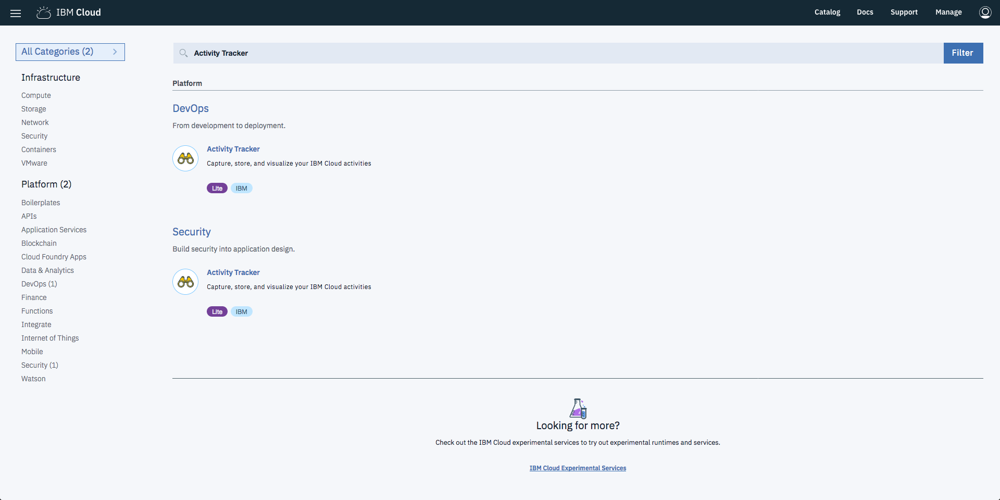
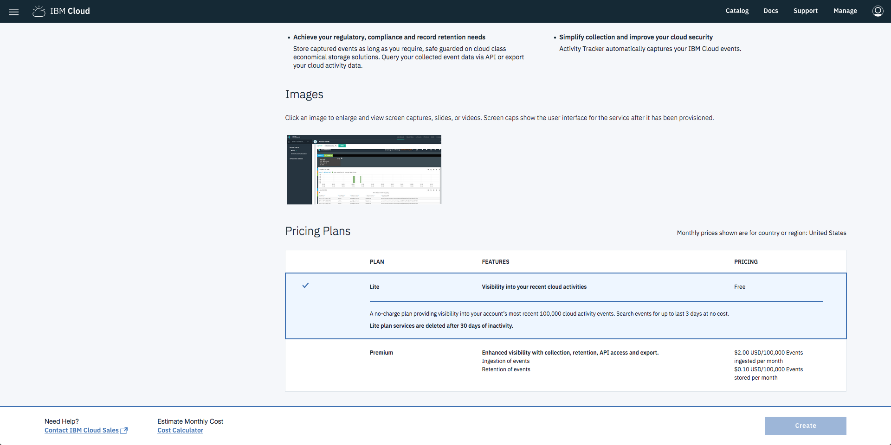
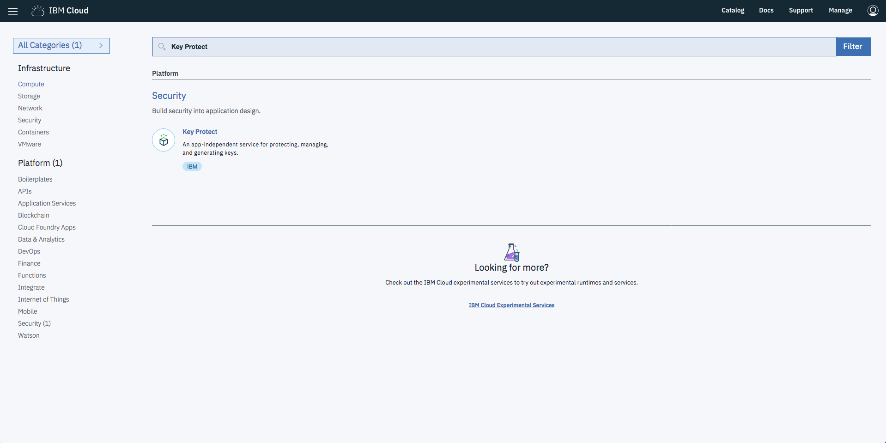
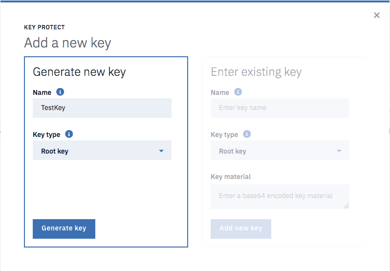
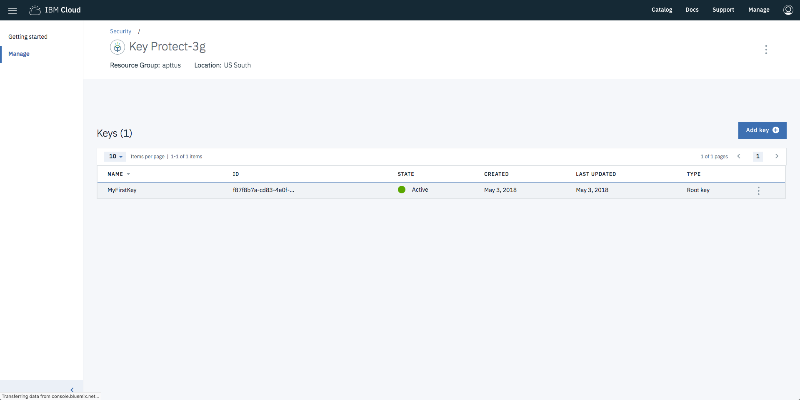
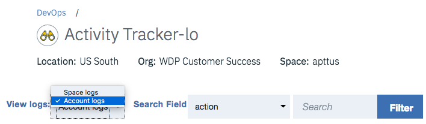
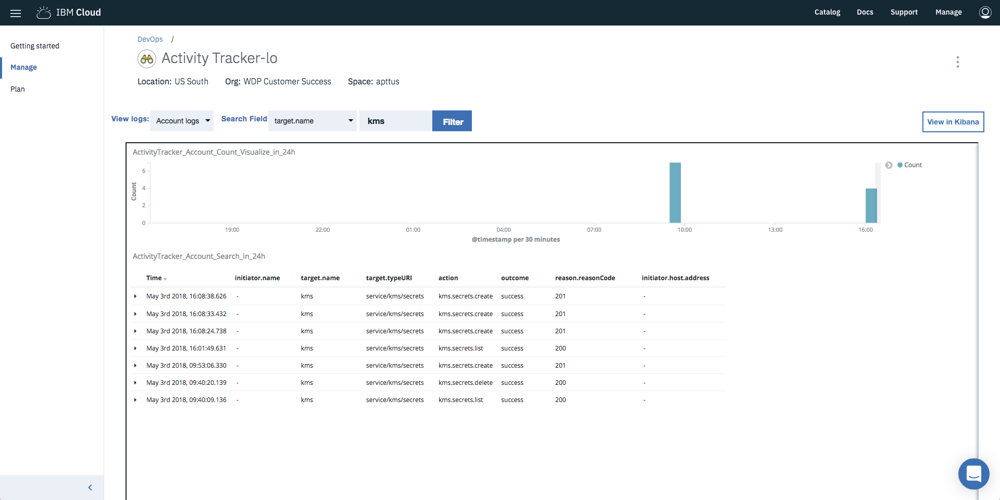
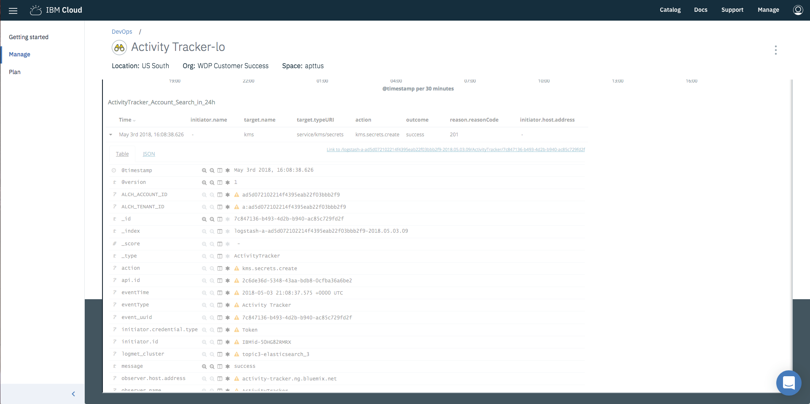
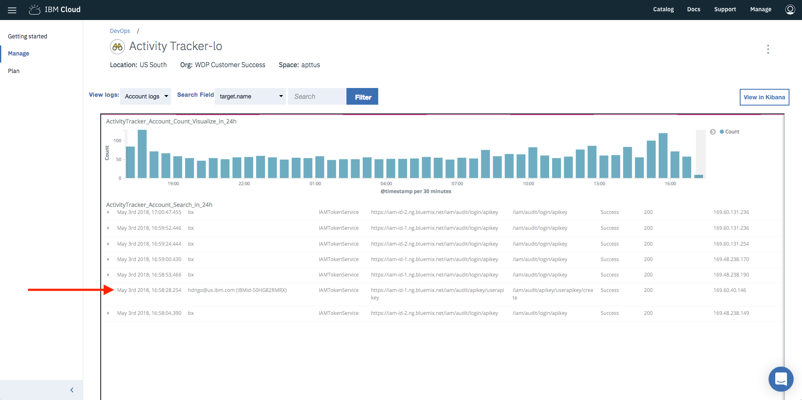

# Monitor Key Protect Events in Activity Tracker

### Objective: To monitor Key Protect events (specifically key creation and key deletion) using Activity Tracker on IBM Cloud and be able to see who initiated the event.

### Prerequisite: Access to an IBM Cloud user that is an Account Owner.

## Instructions

1. Provision an instance of Activity Tracker through the IBM Cloud Catalog.


2. Choose a pricing plan. The main difference between the Lite and Premium versions is that the Lite version has a data retention period of 3 days. For the purposes of this guide, either version is fine.


3. After filling out the options and clicking `Create`, you will be directed to the Activity Tracker instance dashboard page. You can head to the `Manage` tab to make sure everything looks fine if you wish, but an instance of Key Protect also needs to be provisioned.

4. Head back to the IBM Cloud Catalog page. Search for Key Protect.

Fill out the required information and click `Create`.


5. Once you're directed to the Key Protect dashboard page, go to the `Manage` tab. Here, you can create your first key. Click the `Create` button and a prompt will open. Generate a new key by giving your key a name and key type (Root key is fine).


6. You can create additional keys if you wish, and also delete them. This will log additional events in Activity Tracker that you'll be able to see.

### At this point, you can take a look at your Activity Tracker events either through the UI or the CLI. The UI makes it easier to find the Key Protect events quickly. The CLI allows you to download a JSON file of all log events within a specified date range so that you can parse and ingest the logs however you see fit.

#### UI
1. Navigate to your Activity Tracker instance. On the manage tab, you'll be taken to the default `Space logs` view. You'll be able to see some events in this view, such as Activity Tracker being provisioned. Other events that are logged in this view include when a user is added to the space, when user permissions/roles are modified for the space, when a service instance is updated, etc.

2. Click the `View logs` dropdown and change it to `Account logs`. At this point, if you are not an Account Owner, then you will be denied access to viewing the `Account logs`. The ability to view the account level logs currently is restricted to ONLY an Account Owner and cannot be bestowed to other users.


3. Once the Account logs have loaded, you will most likely see numerous events being logged. To find Key Protect events specifically, we'll need to filter. Click the `Search Field` dropdown and select `target.name`. Type `kms` in the input field next to it and click `Filter`. After the results have loaded, you should be able to see the Key Protect creates and deletes you performed earlier.


#### CLI
1. Make sure you have the [IBM Cloud CLI](https://console.bluemix.net/docs/cli/reference/bluemix_cli/get_started.html#getting-started) installed. Install the Activity Tracker plugin following the documentation [here](https://pages.github.ibm.com/activity-tracker/activity-tracker-cli/v3/install/).

2. Once you have both of them installed, login to IBM Cloud and select the correct org and space using `bx target --cf`.

3. You can check to see how many events were logged in a given date range before downloading the JSON file using this command:

  ```
  ➜  ~ bx cf at status -s 2018-05-03 -e 2018-05-03 -a
  Invoking 'cf at status -s 2018-05-03 -e 2018-05-03 -a'...

  +------------+-------+------------+
  | Date       | Count | Searchable |
  +------------+-------+------------+
  | 2018-05-03 | 2660  | All        |
  +------------+-------+------------+
  ```

  The `-s` tag specifies a start date, the `-e` tag specifies an end date, and the `-a` tag specifies that it's at the account level instead of the space level.

4. Create a session to download the JSON data.
  ```
  ➜  ~ bx cf at session create -s 2018-05-03 -e 2018-05-03 -a       
  Invoking 'cf at session create -s 2018-05-03 -e 2018-05-03 -a'...

  +-------------+--------------------------------------------------+
  | Name        | Value                                            |
  +-------------+--------------------------------------------------+
  | types       | {"AtAccountLevel":true,"Type":"ActivityTracker"} |
  | search-time |                                                  |
  | id          | bd7a9ea2-7d4d-4a0a-9693-b9d6448d7443             |
  | space       | 94083b2f-c637-40a6-9d9f-0bda758fbc03             |
  | username    | wdpcs@us.ibm.com                                 |
  | create-time | 2018-05-03T21:35:17.317184407Z                   |
  | access-time | 2018-05-03T21:35:17.317184407Z                   |
  | date-range  | {"End":"2018-05-03","Start":"2018-05-03"}        |
  +-------------+--------------------------------------------------+
  ```

5. Download the Activity Tracker JSON logs using the session ID you just received. The `-o` tag specifies the file location you want the data to be downloaded to and the string right after that is the session ID.
  ```
  ➜  ~ bx cf at download -o Downloads/events.log bd7a9ea2-7d4d-4a0a-9693-b9d6448d7443
  Invoking 'cf at download -o Downloads/events.log bd7a9ea2-7d4d-4a0a-9693-b9d6448d7443'...

   6.84 MiB / 2.27 MiB [====================] 302.00% 101.35 KiB/s 1m9s
  Download Successfully
  ```

  Note: there's a bug with the download where the progress bar displays incorrect values.

6. Open the file and you will most likely be welcomed by a large amount of JSON data (depending on the amount of events in your session date range). Here, you can filter, search, and parse as necessary. If you want to find the Key Protect events, you can search `kms`.

7. The session does not get deleted automatically, so you can do so with the following command.
  ```
  ➜  ~ bx cf at session delete bd7a9ea2-7d4d-4a0a-9693-b9d6448d7443
  Invoking 'cf at session delete bd7a9ea2-7d4d-4a0a-9693-b9d6448d7443'...

  Are you sure to delete session with ID bd7a9ea2-7d4d-4a0a-9693-b9d6448d7443 ? [y/N] y
  The session with ID bd7a9ea2-7d4d-4a0a-9693-b9d6448d7443 has been deleted successfully.
  ```

### Connecting a Key Protect event to a user

While Key Protect logs stored in Activity Tracker don't explicitly store the email/name of the user who triggered the Key Protect events, there is a way to do so by cross referencing the user's IBM ID. This is a workaround, and is not intended to be a solution due to the fact that in order to accurately match every possible Key Protect event, you would need every user in the organization (or at least, every potential user of Key Protect) to follow these steps and then store their IBM IDs to cross reference them with any given Key Protect event log.

1. Take a look at the Key Protect event that you want to investigate. You can open a specific event up, and see additional data either in Table or JSON view.


2. In either view, find the `initiator.id` value. This is the internal IBM Cloud ID belonging to the user who initiated the event in Key Protect. However, there's not an easy way to get a list of the organization's users and their IBM Cloud IDs.

3. Have the original user (who initiated the event) go to `Manage -> Security -> Platform API Keys`. Once there, have them create a key. The name and description is irrelevant.

4. Once they've created it, go back to Activity Tracker (Account logs). In the recent logs, you should see an event that has an `action` of `/iam/audit/apikey/userapikey/create`. In the same event, the `initiator.name` field will have the email of the user who triggered it and also their IBM Cloud ID. This will match the `initiator.id` of the Key Protect event we took a look at earlier.


5. The reason that this is not feasible for a customer in a production setting (or any setting for that matter), is that in order to match a Key Protect event at any given time, you would need to have all potentials users create a Platform API Key beforehand and store all the emails/IBM IDs elsewhere to cross reference them with the event.

Note: The IBM Cloud CLI has a call that, in theory, could potentially return a list of org users (with their emails and IBM IDs). However, when testing it, I ran into an issue where it would print out a number of blank lines and no information.

  ```
  ➜  ~ bx cf org-users "WDP Customer Success" -a                   
  Invoking 'cf org-users WDP Customer Success -a'...

  Getting users in org WDP Customer Success as wdpcs@us.ibm.com...

  USERS


  ```
