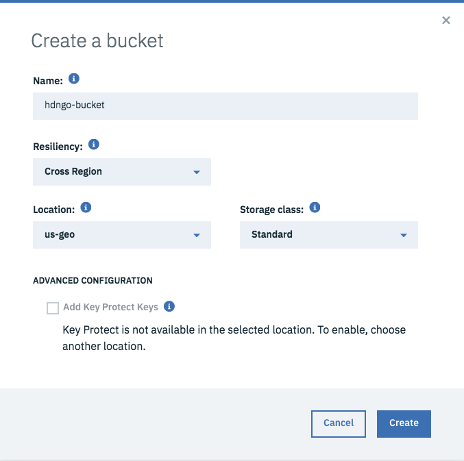
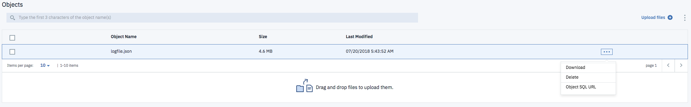
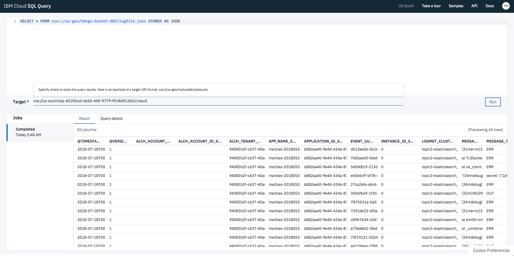

# Log Management

### Objective: Downloading logs, storing them in Cloud Object Storage, and using SQL Query service.

## Downloading Logs

To [download logs](https://console.bluemix.net/docs/services/CloudLogAnalysis/how-to/manage-logs/downloading_logs_cloud.html), you first need to install the IBM Cloud Logging plugin.
  ```
  bx plugin install logging-cli -r Bluemix
  ```

Once you're logged in through the IBM Cloud CLI, you need to select a space to download logs from. Use `bx target --cf` to choose a space interactively, or `bx target --cf-api ENDPOINT -o ORG -s SPACE` to choose it directly.

Prior to downloading log data, you must create a session. You can specify a session start date, end date, type, and more depending on what log data that you want. To see all the possible parameters, look [here](https://console.bluemix.net/docs/services/CloudLogAnalysis/reference/log_analysis_cli_cloud.html#session_create). By default, the date range is 2 weeks up to the current UTC date.

  ```
  bx logging session-create
  Creating session for hdngo@us.ibm.com resource: 94083b2f-c637-40a6-9d9f-0bda758fbc03 ...

  ID                                     Space ID                               Creation Time                    Start        End          Time   Type   
  da3c7d93-4ba0-4f41-897f-5ec81f636cba   94083b2f-c637-40a6-9d9f-0bda758fbc03   2018-07-19T09:40:10.377477414Z   2018-07-07   2018-07-19   *      *   
  Session: da3c7d93-4ba0-4f41-897f-5ec81f636cba is created
  OK
  ```

With the session created, you can now download the logs for that session. The command below downloads the logs zipped in .gz format and can be unzipped into JSON.
  ```
  bx logging log-download -o logfile.gz da3c7d93-4ba0-4f41-897f-5ec81f636cba
  Downloading logs by session da3c7d93-4ba0-4f41-897f-5ec81f636cba for 94083b2f-c637-40a6-9d9f-0bda758fbc03 ...
   16.72 MiB / 28.36 MiB [=============================================================================================================>---------------------------------------------------------------------------]  58.96% 8.94 KiB/s
  ```

Once the log data finishes downloading, don't forget to delete your session.
  ```
  bx logging session-delete da3c7d93-4ba0-4f41-897f-5ec81f636cba
  Deleting session: da3c7d93-4ba0-4f41-897f-5ec81f636cba of resource: 94083b2f-c637-40a6-9d9f-0bda758fbc03 ...
  Session: da3c7d93-4ba0-4f41-897f-5ec81f636cba is deleted
  OK
  ```

Note: if you're downloading logs through the `bx cf` plugin, you can look [here](https://console.bluemix.net/docs/services/CloudLogAnalysis/how-to/manage-logs/downloading_logs.html#downloading_logs). The commands are almost identical, with some exceptions.

#### Helpful Links
- https://console.bluemix.net/docs/services/CloudLogAnalysis/manage_logs.html#manage_logs
- https://console.bluemix.net/docs/services/CloudLogAnalysis/how-to/manage-logs/downloading_logs_cloud.html#downloading_logs
- https://console.bluemix.net/docs/services/CloudLogAnalysis/how-to/manage-logs/downloading_logs.html#downloading_logs

## Storing Logs in Cloud Object Storage

Provision an instance of [Cloud Object Storage](https://console.bluemix.net/catalog/services/cloud-object-storage) through the catalog. Once provisioned successfully, launch the service and create a bucket.

  

Go into your bucket and upload the unzipped version of the log data that you downloaded previously. It should be labeled as a .json object. After uploading, hover over the object to open up the menu and copy the `Object SQL URL`. You'll need this for using the SQL Query service.

  

#### Helpful Links
- https://console.bluemix.net/docs/services/cloud-object-storage/about-cos.html

## Querying logs using SQL Query service

Provision an instance of [SQL Query](https://console.bluemix.net/catalog/services/sql-query) through the catalog. Once provisioned successfully, launch the service and open the UI.

Near the top of the page, you should see a text field saying `Type SQL here ...` where you'll be running SQL queries on the log file. Using the Object SQL URL you copied earlier, you're going to do a simple SELECT query on the log data.

Type `SELECT * FROM <Object SQL URL` STORED AS JSON` into the text field. Then click the `Run` button. Once the query has finished executed, you should see a preview of the results on the bottom half of the page.

  

This is an extremely simple example of how to perform a SQL query on your log data stored in IBM Cloud Object Storage. You can perform any SQL Query that you wish in order to receive the results that you're looking for on the log data.

For more information, take a look at the [documentation](https://console.bluemix.net/docs/services/sql-query/sql-query.html).

#### Helpful Links
- https://console.bluemix.net/docs/services/sql-query/getting-started.html#getting-started-tutorial
- https://console.bluemix.net/docs/services/sql-query/sql-query.html
