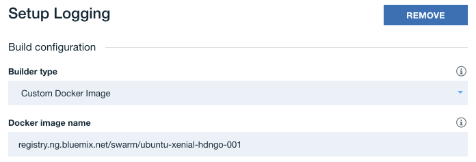
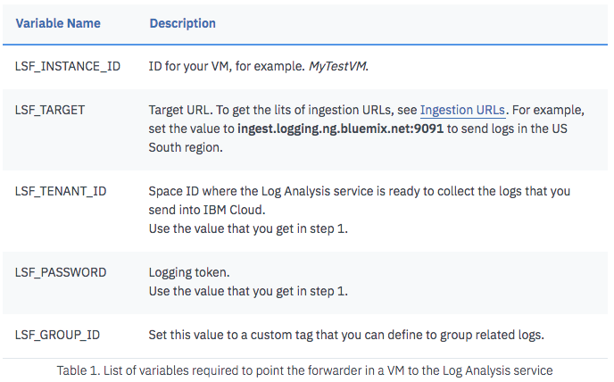

# Logging on IBM Cloud DevOps Toolchain

### Objective: To collect logs from IBM Cloud DevOps Toolchain and send them to the Log Analysis service.

### Prerequisites
- Toolchain on IBM Cloud with Pipeline and Stage
- Custom Docker image
- A running instance of Log Analysis

## Instructions for sending Logs to Log Analysis

1. To send logs to the Log Analysis service, you will first need a custom Docker image. While the DevOps toolchain has it's own Docker image, it's restrictive in what it allows you to do in the build scripts such asinstalling packages through apt-get and starting services.

  The Dockerfile for this custom Docker image can be found [here](https://github.ibm.com/customer-success/swarm/blob/ci-cd/sockstore/docker/ubuntu/Dockerfile). You can use it as a frame of reference for your own Dockerfile. It is Ubuntu 16.04 (Xenial). The commands within are for the most part, translated from this [guide](https://console.bluemix.net/docs/services/CloudLogAnalysis/how-to/send-data/send_data_mt.html#prereqs) on how to send on-premises data. It also has commands to set up the IBM Cloud CLI, kubectl (Kubernetes command-line tool), and Helm.

2. Once your Dockerfile is complete, build, tag, and push it to the IBM Cloud Container Registry so the toolchain can access it.
  ```
  docker build -t registry.ng.bluemix.net/<namespace>/<image> .
  docker push registry.ng.bluemix.net/<namespace>/<image>
  ```

3. Head to your toolchain and open up a Delivery Pipeline. In the configuration menu of a stage, there's a `Build configuration` section. For `Builder type`, choose `Custom Docker Image` and provide the link to your image uploaded to a registry in `Docker image name`.



4. In order for the toolchain to access your image on the IBM Cloud Container Registry, you'll need to provide an API Key in the `Environment Properties` section. To do so, follow the steps [here](https://console.bluemix.net/docs/services/ContinuousDelivery/pipeline_custom_docker_images.html#private_image_registry).

5. Back in the `Build configuration` section, there's a text area for a `Build script`. This will be where you complete setting up mt-logstash-forwarder and create logs to be sent to Log Analysis, as well as anything else you need.

  Below is a shell script that creates a directory and log file, starts the mt-logstash-forwarder service, configures it, and then prints a log to the log file.

  ```
  mkdir /home/pipeline/logs
  touch /home/pipeline/logs/<log file>.log

  /opt/mt-logstash-forwarder/init/deb-init.d/mt-logstash-forwarder.init start

  echo 'LSF_INSTANCE_ID="<instance>"' > /etc/mt-logstash-forwarder/mt-lsf-config.sh
  echo 'LSF_TARGET="<ingestion URL>"' >> /etc/mt-logstash-forwarder/mt-lsf-config.sh
  echo 'LSF_TENANT_ID="<space ID>"' >> /etc/mt-logstash-forwarder/mt-lsf-config.sh
  echo 'LSF_PASSWORD="<logging token>"' >> /etc/mt-logstash-forwarder/mt-lsf-config.sh
  echo 'LSF_GROUP_ID="<Custom tag to group related logs"' >> /etc/mt-logstash-forwarder/mt-lsf-config.sh

  echo '# The list of files configurations
  {
      "files": [
          {
          "paths": ["/home/pipeline/logs/<log file>.log"],
          "fields": { "type": "<type for easy filtering in Log Analysis>" },
          "is_json": false
      }
      ]
  }' > /etc/mt-logstash-forwarder/conf.d/<name of config file>.conf

  /opt/mt-logstash-forwarder/init/deb-init.d/mt-logstash-forwarder.init force-reload

  echo "${BUILD_ID}: mt-logstash-forwarder started" | tee -a /home/pipeline/logs/otc-logging.log
  ```

  

  You will need to modify the commands in the shell script with your own information. For more information on the LSF values, see this [documentation](https://console.bluemix.net/docs/services/CloudLogAnalysis/how-to/send-data/send_data_mt.html#configure_mt_logstash_forwarder).

  In addition to setting up mt-logstash-forwarder, the `<log file>.log` and `<name of config file>.conf` is specifying additional logs for the log forwarder to watch since by default, it only watches syslogs. For more information on specifying custom logs, see [here](https://console.bluemix.net/docs/services/CloudLogAnalysis/how-to/send-data/send_data_mt.html#add_logs).

6. The pipeline stage should now be configured to send logs to Log Analysis! A few things to note:
  - You must output your logs to the specified log file for mt-logstash-forwarder to collect them.
  - It's recommended to have a short sleep time (such as 1minute) at the end of the build script in order to make sure that the stage doesn't complete execution before the logs are collected and sent.
  - For each stage in a pipeline, you will need to specify the Custom Docker Image and set up the mt-logstash-forwarder in the build script. This is due to the fact that each stage is seperate from the previous stage in the pipeline.

7. Launch the Log Analysis service. On the left hand side, you should see `type` as an available field (`_type` is identical, so either works). You should see logs belonging to the type that you specified above in `<name of config file>.conf`. If there's too many logs for you to see your own recently, you can filter in the query bar above by searching `type: <type for easy filtering in Log Analysis>`.

### Helpful Links
- https://github.ibm.com/customer-success/swarm/blob/ci-cd/sockstore/docker/ubuntu/Dockerfile
- https://console.bluemix.net/docs/services/CloudLogAnalysis/how-to/send-data/send_data_mt.html#prereqs
- https://console.bluemix.net/docs/services/ContinuousDelivery/pipeline_custom_docker_images.html#custom_docker_images
