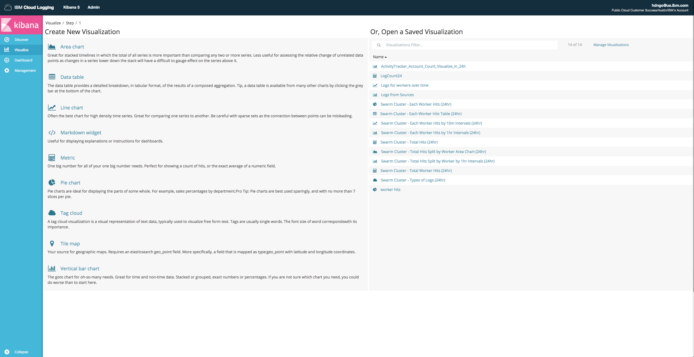

# Viewing and Analyzing Logs

### Objective: Viewing and analyzing logs through creating visualizations on Kibana and Grafana.

## Visualizations on Kibana
This example will show how to [create basic visualizations](https://console.bluemix.net/docs/tutorials/kubernetes-log-analysis-kibana.html#visualize-logs) with logs from a cluster in IBM Cloud.

Launch your instance of Log Analysis. You can provision an instance through the catalog if you haven't already. You can also launch Log Analysis by going to the dashboard overview page of your Kubernetes cluster on IBM Cloud Bluemix.

In order to create visualizations from only data that's relevant, you need to filter the logs and save it. Depending on which runtime source you're using, the filters will be slightly different for each one.

Looking at the Kibana interface, you should see the "Available Fields" list. This is what you create filters from. If you're working with a cluster on IBM Cloud Container Service, there should be a field called `ibm-containers.cluster_id_str`. Hover over it and an `add` button will appear. What this does is it adds that field to the main logging view so that you can quickly see which cluster each individual log is coming from.

Find your cluster ID. You can do so through the IBM Cloud CLI by using the command `bx cs clusters` or `ibmcloud bx clusters`. This will give you a list of all clusters in your account with their names and IDs. In Kibana, you should see a search bar near the top of the page. By default, it will have a `*` in it for all logs. To filter based on the cluster ID, type `ibm-containers.cluster_id_str: YOUR_CLUSTER_ID` and press enter. This will return only logs matching that field value. You can filter on multiple fields by using operands such as AND and OR.

After applying the filter and getting the correct data set, click the `Save` button in the upper right. Name it something easily identifiable for the visualizations.

On the left hand side, there's a `Visualize` tab. Select it and you should see a number of options for creating a new visualization.

  

To start off, select `Metric`. Then select, your saved search filter that you previously named. You'll see a page where you can customize your visualization with different metrics and aggregation types. It should have a default metric created with a `Count` aggregation. This is a count of all the logs coming from your cluster in the timeframe with the saved data set. It's a very basic visualization to illustrate creating one. Click `Save` in the upper right corner and name your visualization. Then click `New` to go back to create another visualization.

Select `Line chart`. You'll see that it already has a `Y-Axis` metric. Below that, there are different buckets you can add to the chart. Choose `X-Axis`. For the `Aggregation`, pick Date Histogram. The `Field` should be `@timestamp` and the `Interval` can be `Auto` for now. Near the top of the column, there's a Play button next to a Close button. Click the Play button and your visualization should generate. This line chart shows the number of logs generated at each timestamp. Save your visualization.

With a couple visualizations created, you can now create a dashboard and add your visualizations. On the left hand side, click `Dashboard`. In the upper right, click `New` and then `Add`. Select the two visualizations you previously created. With the visualizations added, you can move them around to position them and drag to increase their size. Save your dashboard.

  

You've now created a couple basic visualizations and added them to a dashboard! You can create as many additional visualizations as you want, with different data sets and filtered queries.

#### Helpful Links
- https://console.bluemix.net/docs/tutorials/kubernetes-log-analysis-kibana.html#visualize-logs
- https://fxdata.cloud/tutorials/use-kibana-dashboards-and-visualizations

## Visualizations on Grafana
You can use Grafana to monitor your cluster health. It is enabled by default on a standard cluster. To launch Grafana, go to the dashboard overview page of your Kubernetes cluster on IBM Cloud Bluemix. Besides the `Metrics` field, select the `View` button.

Grafana will open up in a new tab and you should see a dashboard with a number of visualizations already populated for you. Near the top, you can select the Cluster and Namespace, as well as other options. The metrics include cluster data such as Pod Usage, Container Usage, and Worker Load and Errors.

  

You can create a new dashboard of your own to customize by selecting the dropdown at the top and clicking `Create New`. It's also possible to import an existing dashboard that someone else has created and shared for public use.

To add a new visualization to an existing dashboard, scroll all the way to the bottom and click `Add Row`. From there, choose what kind of panel you want to add to the row. Once you've chosen one, you need to populate it with a data query. Click the panel itself, and a menu will pop up. Select `Edit`. From this page, you can edit your graph as you see fit. For more information, see [here](http://docs.grafana.org/guides/getting_started/#adding-editing-graphs-and-panels). After you finish customizing your graph, click `Back to Dashboard` near the top.

  

On the left side of each row, there's a small menu that you can hover over in order to select options such as moving a row up/down.

#### Helpful Links
- https://console.bluemix.net/docs/tutorials/kubernetes-log-analysis-kibana.html#monitor-cluster-health-using-grafana
- http://docs.grafana.org/guides/getting_started/#adding-editing-graphs-and-panels
