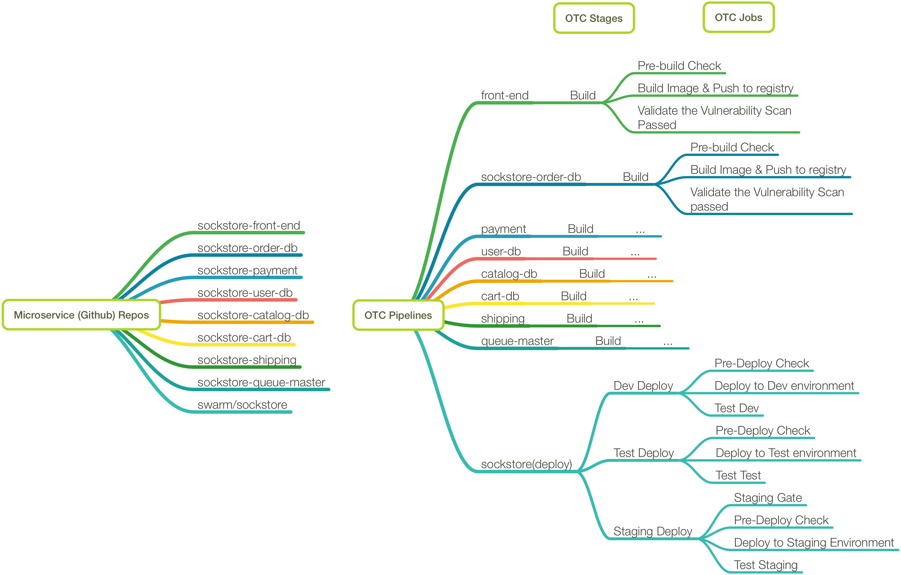

## Documentation OTC dev, test, staging.

#### The Sockstore app has...
8 Micro-Services:
- Front-End (NodeJs)
- Order (MongoDB, Java/.NET Core)
- Payment (Go)
- User (MongoDB, Go)
- Catalog (MySQL DB, Go)
- Cart (MongoDB, Java)
- Shipping (Java)
- Queue-Master (Java)

1 Infrastructure Component:
- RabbitMQ

1 Umbrella Helm Chart for Deployment:
- swarm/sockstore

For the CI/CD design we are going to implement 3 different environments: **Dev**, **Test**, & **Staging**. We also would like to follow the _build once, deploy many_ best practice when it comes to images.
The purpose of the IBM OpenToolchain Service is to create an automated CI/CD solution for building and deploying code into the cloud.
Within a single OTC toolchain, there will be 1 pipeline for _each_ micro-service and 1 for the swarm/sockstore (deployment) service; a total of 9 pipelines.  Each micro-service pipeline will have the same Stages and Jobs that make them all up, but will contain slightly different configuration values.

#### The example flow for one micro-service will be...
1. Developer pushes code to micro-service github repo (master branch), **xyz**
1. xyz OTC pipeline starts with its first stage, **Build**
  1. First, Build stage checks to make sure everything is in place for the new image for xyz service to be built and pushed to the desired image repository.
  2. Next, it builds and pushes the image to the specified location.
  3. Lastly, if the image is pushed to the IBM image registry we will check to make sure the vulnerability scan passed.

#### The actual flow for the deployment pipeline will look something like...
1. Once the image is built and scanned successfully, the **Dev Deploy** stage will begin.
  1. The first job checks to make sure everything is in place to deploy to the development environment.
  2. Then the second job deploys the newly built image to dev.
  3. Once deployed, the third job within the stage will run tests against the newly deployed version of the micro-service in dev.
1. Once the Dev Deploy stage completes successfully, the **Test Deploy** stage will begin.
  1. The first job checks to make sure everything is in place to deploy to the test environment.
  2. Then the second job deploys the newly built image to test.
  3. Once deployed, the third job within the stage will run tests against the newly deployed version of the micro-service in test.
1. Once the Test Deploy stage completes successfully, the **Staging Deploy** stage will begin.
  1. The first job checks to make sure everything is in place to deploy to the staging environment.
  2. Then the second job deploys the newly built image to staging.
  3. Once deployed, the third job within the stage will run tests against the newly deployed version of the micro-service in staging.

