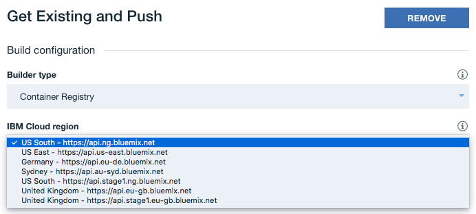

# Multi-region Deployment in Open Toolchain

### Objective: Deploying Sockstore in multiple regions simultaneously within one Open Toolchain.

### Prerequisites
- Two IBM Cloud clusters on separate regions
- [Kubernetes command-line tool, `kubectl`, installed](https://kubernetes.io/docs/tasks/tools/install-kubectl/)

## Instructions for Deploying Sockstore

1. Deploying to a namespace within a cluster other than the default requires you to transfer the bluemix secrets from the default namespace into the new one. You will also need to patch the `serviceaccount` to use them as `imagePullSecrets`. To do so, execute the commands below but replace `<name>` with the new namespace.
  ```
  kubectl config set-context $(kubectl config current-context) --namespace=default
  kubectl get secret bluemix-default-secret -o yaml | sed 's/default/<name>/g' | kubectl -n <name> create -f -
  kubectl get secret bluemix-default-secret-international -o yaml | sed 's/default/<name>/g' | kubectl -n <name> create -f -
  kubectl get secret bluemix-default-secret-regional -o yaml | sed 's/default/<name>/g' | kubectl -n <name> create -f -
  kubectl config set-context $(kubectl config current-context) --namespace=<name>
  kubectl patch serviceaccount default -p '{"imagePullSecrets": [{"name": "bluemix-<name>-secret"},{"name": "bluemix-<name>-secret-international"},{"name":"bluemix-<name>-secret-regional"}]}'
  ```
  These commands selects the default namespace, gets each secret (default, international, and regional), creates them for the new namespace, and then patches them to the `serviceaccount`.

2. If you don't have Cert Manager configured on your clusters, you will need to do so in order to successfully deploy Sockstore into that cluster. You can take a look at the documentation [here](../cert-manager/README.md).

3. If you'd like to set up App ID for your Sockstore deployment, you can see how to do so [here](../appid/README.md). App ID integration provides user authentication to your application but is optional. If you wish to disable App ID integration, do not provide an `APPID_ALIAS` environment variable when configuring the Open Toolchain `deploy` Delivery Pipeline. Otherwise, create an `APPID_ALIAS` environment variable and set it as the alias you choose when following the documentation.

4. To deploy Sockstore in a single region, you can set it up according to the documentation [here](overview-otc-doc.md). You'll be modifying it to deploy to an additional region afterwards.

5. Once you have Sockstore set up within Open Toolchain, you will begin adding additional stages to deploy to a separate region. Each Delivery Pipeline (with the exception of the `deploy` pipeline) builds and pushes an image to the registry for that region. For each Delivery Pipeline besides `deploy`, you'll need to do the following:
  - Click into the Delivery Pipeline.
  - For the `GET EXISTING` Stage, click the gear icon in the upper right.
  - Select `Clone Stage`.
    
  - You can configure your cloned stage as you see fit, but for the purposes of setting up multi-region deployment, click the `JOBS` tab at the top. You should see a dropdown menu labeled `IBM Cloud region` below. Select the region that you wish to set up a deployment to.
    
  - Everything else should be fine to be left alone. If your API Key dropdown is blank, you will need to create and add an API key. You can see how to do so [here](https://console.bluemix.net/docs/iam/userid_keys.html#userapikey).
  - Click `SAVE` at the bottom.
  - Back at the Delivery Pipeline interface, you should see your original stage and the cloned one. You can move them around based on your preference on which stage you wish to run first.
    
  - Trigger a run by clicking the play icon on the first stage. This will build and push the image to that region's registry so that the `deploy` pipeline can successfully pull and deploy the image for Sockstore.

  Make sure to do the same for each Delivery Pipeline except the `deploy` pipeline in order to have the images pushed into the regional registries.

6. Now you're ready to configure your `deploy` pipeline. The process will be somewhat similar to the other pipelines.
  - Click into the `deploy` Delivery Pipeline.
  - Clone the DEV Deploy stage. The next screen will be the configuration page for your cloned stage.
  - Click the `JOBS` tab at the top. In the box below the `JOBS` tab, you should see a job labeled `Deploy Helm chart`. Make sure that it's selected.
  - Below, the `Deployer type` should be `Customer Docker Image`. The `Docker image name` should be something along the lines of `${REGISTRY_URL}/${REGISTRY_NAMESPACE}/ubuntu-xenial`. You can double check this in the `custom docker` Deliver Pipeline logs from the previous build.
  - The Deploy script area should look like this:
    ```
    #!/bin/bash
    source "./sockstore/scripts/otc/simple-deploy.sh"
    ```
  - Now click `ENVIRONMENT PROPERTIES` tab at the top. You'll have to modify the environment properties that get passed into the job to be accessible by the deploy script.
    

    - `API_URL`: This value should be changed to the API of the region this cloned stage is deploying to.
      ```
      US South - api.ng.bluemix.net
      Sydney/Tokyo - api.au-syd.bluemix.net
      Germany/EU - api.eu-de.bluemix.net
      United Kingdom - api.eu-gb.bluemix.net
      ```
    - `API_KEY`: This is an API Key generated from your account that allows this job to run successfully. You can learn how to generate one [here](https://console.bluemix.net/docs/iam/userid_keys.html#userapikey).
    - `REGION`: Change this to the value below, corresponding to the region you're deploying to.
      ```
      US South - us-south
      Sydney/Tokyo - ap-south
      Germany/EU - eu-central
      United Kingdom - uk-south
      ```
    - `REGISTRY_URL`: Change this to match the value of the regional registry you're deploying to.
      ```
      US South - registry.ng.bluemix.net
      Sydney/Tokyo - registry.au-syd.bluemix.net
      Germany/EU - registry.eu-de.bluemix.net
      United Kingdom - registry.eu-gb.bluemix.net
      ```
    - `REGISTRY_NAMESPACE`: The namespace that your images from the previous pipelines were pushed to in the registry.
    - `DOCKER_USERNAME`: This needs to remain `iamapikey`. It's what the toolchain uses to authenticate with Docker.
    - `DOCKER_PASSWORD`: This should be the same as the `API_KEY` value from above.
    - `CLUSTER_NAME`: The name of your cluster in this region.
    - `CLUSTER_NAMESPACE`: The namespace you want to deploy to within your cluster.
    - `INGRESS_HOST`: The hostname that you want the application to be published to.
    - `INGRESS_SUBDOMAIN`: The subdomain of your cluster. This is in the format of `${CLUSTER_NAME}.${REGION}.containers.appdomain.cloud`.
    - `APPID_ALIAS`: The alias for App ID if you wanted App ID integration from previously. If you did not, leave it blank or you can remove the property entirely.
  - Click Save. You can now trigger a run by pressing the play icon in the upper right corner of the stage. It should begin deployment of Sockstore by pulling each of the images that you had built and pushed to the registry from the other Delivery Pipelines.

7. Once the stage is finished running, you can navigate to `${INGRESS_HOST}/${INGRESS_SUBDOMAIN}` to take a look at your deployed application! If you have App ID integration, you'll need to log in with a user created within App ID. If not, you should see the Sockstore landing page.

#### Helpful Links

- https://console.bluemix.net/docs/containers/cs_regions.html#regions-and-zones
- https://console.bluemix.net/docs/iam/userid_keys.html#userapikey
- https://console.bluemix.net/docs/services/ContinuousDelivery/pipeline_about.html#deliverypipeline_about
- https://console.bluemix.net/docs/services/ContinuousDelivery/pipeline_custom_docker_images.html#custom_docker_images
