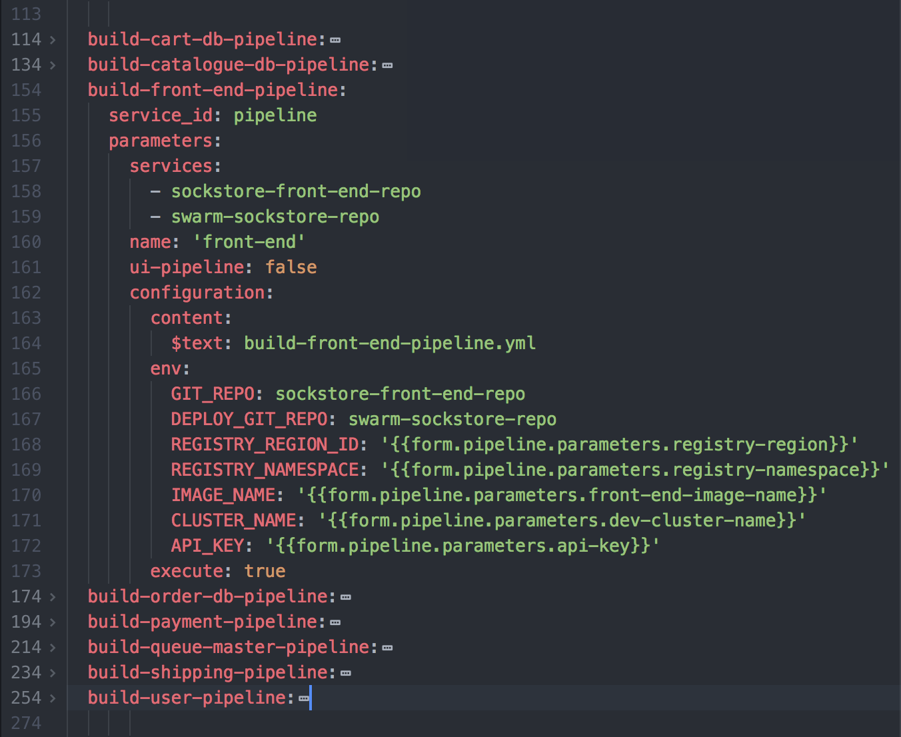

# Sockstore Open Toolchain Documentation
This documentation walks you through how to build a continuous delivery toolchain for the Sockstore Application using IBMs Open Toolchain Service.  

## Getting Started
In order to get started with IBM's Open Toolchain service, please review the getting started doc [here](https://console.bluemix.net/docs/services/ContinuousDelivery/index.html#cd_getting_started).  

The Sockstore application has eight micro-services and this documentation walks through how I created a toolchain for deploying the app into three different environments: development, testing, and staging.


Make sure that you have a Kubernetes cluster set up in the region that you'd like to deploy the Sockstore application to.  The correct secrets need to be moved from the default namespace to the Kubernetes cluster namespace(s) that you plan to use.  For example, when I launched the Sockstore application, I utilized three namespaces (one for each environment): dev-ci-cd, test-ci-cd, and staging-ci-cd.

Sockstore is integrated with using IBM's AppID so another step to setting up the cluster for application is to bind the cluster namespace to an AppID instance. This [link](https://github.ibm.com/customer-success/swarm/tree/master/sockstore/docs/appid) explains how to create an AppID and bind it to a cluster.  **Be sure to double check that you have the correct access permissions on the cluster to perform this step.**

Once you have a Kubernetes Cluster and a namespace set up, you're ready to get started!

## Build toolchain.yaml
Use the documentation [here](https://console.bluemix.net/docs/services/ContinuousDelivery/toolchains_custom.html#toolchains_custom_toolchain_yml) as a resource to create your **toolchain.yaml**. Create a service for each repository and each delivery pipeline. In this case, I created nine repository services, eight build pipelines, and one deploy pipeline. List all 18 services/pipelines in the **template.required** section in **toolchain.yaml**.  The following images are all of the pieces of **toolchain.yaml**.

*The image below shows the section that lists the 18 required services.*


*The image below shows the list of repositories defined in the toolchain.  The sockstore-front-end-repo is expanded as an example.*


*The image below shows the list of BUILD pipelines defined in the toolchain.  The build-front-end-pipeline is expanded as an example.*


*The image below shows the deploy-pipeline defined in the toolchain.*


At the bottom of **toolchain.yaml**, there is a form section where you can create variables to reference in each service/pipeline. This section can be given values in **toolchain.yaml** or these variables can be connected with an input in the 'Delivery Pipeline' form upon Toolchain creation (we will discuss how to create this form, **deploy.json**, in the next section).

*The two images below show the form section of toolchain.yaml*.  The values that you see filled out with "" are values that will be defaulted to "" and will be set upon creation of the toolchain through the **deploy.json** inputs.  Any values that have default values CAN also be overwritten by values provided through **deploy.json** input values.*


This [link](https://github.com/open-toolchain/sdk/wiki/Template-File-Format) is a great reference for formatting the **toolchain.yaml** file, including the parameters section.

## Build deploy.json
When a toolchain is created from a Deploy to IBM Cloud button, there will be a form that you fill out labeled the Delivery Pipeline. The file, **deploy.json**, is where you add or remove inputs from the Delivery Pipeline form. For each variable that you'd like to be given to the toolchain upon creation, you need to create an input in the form.

It is important to create inputs for any secrets or sensitive information that the application deployment needs so that they aren't stored in a repository insecurely. Also, any environment variables that need to be configurable should be in the form as well.  

This [link](https://console.bluemix.net/docs/services/ContinuousDelivery/toolchains_custom.html#toolchains_custom_deploy_json) explains how to configure **deploy.json** in order to customize the Delivery Pipeline form.

## Build service pipeline.yaml for each micro-service
Since Sockstore has eight different micro-services each in their own Github repository, I defined a Build pipeline for each micro-service.  

```
A toolchain is made up of pipelines.
Pipelines are made up of stages.
Stages are made up of jobs.
```

In order to follow the `Build Once, Deploy Many` practice when it comes to the life of an image, I created a github repository for each micro-service and a build pipeline in the the toolchain. Along with those micro-service repositories, there's also one github repository housing the IBM toolchain **.bluemix** files and the main helm chart for deploying the entire application. In order to deploy the application, I created one pipeline that deployed to three different environments: development, testing, and staging.

## Road Blocks & Detours
Below are the major Road Blocks I ran into during this process and the Detours I created.

#### How can I trigger between a BUILD pipeline and the DEPLOY pipeline?
One decision I needed to make was how to trigger the deploy pipeline after one or more of the build pipelines finishes. The entire cycle would look something like:

> Step 1. Push change to micro-service repo --> triggers micro-service pipeline to BUILD a new image
>
> Step 2 Options.
>  1. After building new image, make a trivial commit to swarm/sockstore repo to trigger it.
>  2. After building new image, manually trigger the swarm/sockstore repo to trigger it.
>  3. After building new image, put deploy stages in same pipeline so that it's triggered by the previous stage...(in each microservice pipeline)
>
>Step 3. Trigger the swarm/sockstore repository to (re)deploy the app

Option 1 is the most desirable option because it would make the trigger between a Build stage finishing and the Deploy stage beginning automatic.  Option 2 is the second best option because although it does add a manual step for the developer, it allows there to be only one Deploy pipeline separated from each Build pipeline.  Option 3 is the least ideal option because even though it triggers the Deploy automatically, it would mean that each Build Pipeline contains the Deploy job.  This strategy utilizes identical code in each pipeline and does not satisfy the practice of keeping the Build and Deploy jobs in separate pipelines for flexibility.  

**Answer:** I ended up choosing Option 2 as a temporary solution, and would like to implement Option 1 when time permits.  

#### How can I create a toolchain that utilizes a Private Github Repository?
**Answer:** I still have not figured out if there is a way to achieve this.

#### How should I tag the images?  
**Answer:** I decided to tag the images with the latest Git Commit number of the relative micro-service's repository.  In the photo below you can see the Git Commit number of a commit on the Sockstore-front-end micro-service repository.  This number is the same one you'll see in the next section, that displays an image of each micro-services image name and tag, under the variable name "FRONT_END_IMAGE_TAG".  

## Conclusion
Overall, this document walks through the set up of Open Toolchain on IBM Cloud and also how to create the toolchain files for Sockstore.  I walked you through my design, the important files necessary for the toolchain, the challenges I experienced along the way and how I worked through them.  

## Helpful Links
[Open Toolchain Documentation](https://console.bluemix.net/docs/services/ContinuousDelivery/index.html#cd_getting_started)

[AppID Documentation](https://github.ibm.com/customer-success/swarm/tree/master/sockstore/docs/appid)

[toolchain.yaml Documentation](https://console.bluemix.net/docs/services/ContinuousDelivery/toolchains_custom.html#toolchains_custom_toolchain_yml)

[More toolchain.yaml help](https://github.com/open-toolchain/sdk/wiki/Template-File-Format)

[deploy.json Documentation](https://console.bluemix.net/docs/services/ContinuousDelivery/toolchains_custom.html#toolchains_custom_deploy_json)
